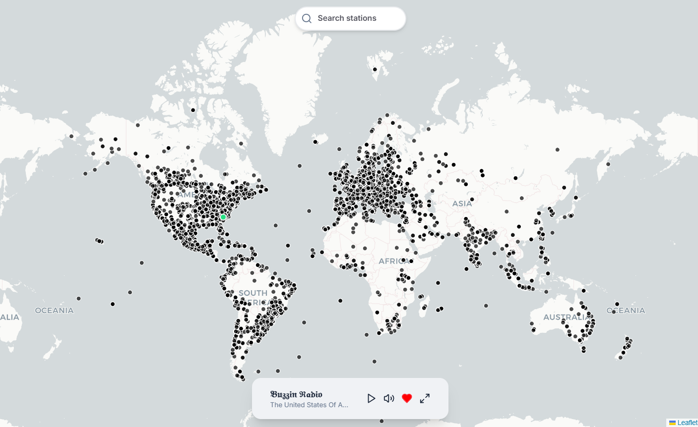
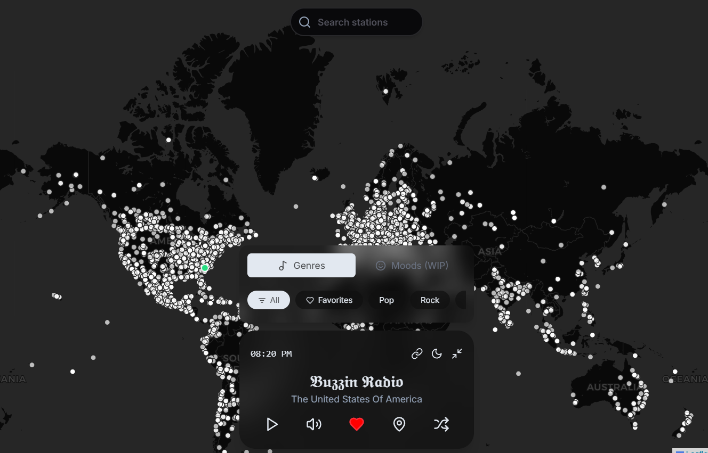

# 🌍 RadioTunes - Global Internet Radio Player
A modern, responsive web application for streaming internet radio stations from around the world. Built with Next.js

## preview

 

 


## ✨ Features

- 🎵 Stream thousands of internet radio stations
- 🗺️ Interactive map view to discover stations by location.
- 🔍 Search and filter stations by name, country, or genre
- ❤️ Favorite your preferred stations for quick access
- 🌓 Dark/Light mode support.
- 📱 Fully responsive design.
- ⚡ Fast and lightweight.

## 🚀 Getting Started

### Prerequisites

- Node.js (v16 or later)
- npm or yarn

### Installation

1. Clone the repository:
   ```bash
   git clone git@github.com:P0SSIBLE-0/Radiotunes.git
   cd radio-app
   ```

2. Install dependencies:
   ```bash
   npm install
   # or
   yarn
   ```

3. Start the development server:
   ```bash
   npm run dev
   # or
   yarn dev
   ```

4. Open [http://localhost:5173](http://localhost:5173) in your browser.

## 🛠️ Built With

- [Next.js](https://nextjs.org/) - JavaScript library for building user interfaces
- [React](https://reactjs.org/) - JavaScript library for building user interfaces
- [TypeScript](https://www.typescriptlang.org/) - Type-safe JavaScript
- [Vite](https://vitejs.dev/) - Next Generation Frontend Tooling
- [Zustand](https://github.com/pmndrs/zustand) - State management
- [Leaflet](https://leafletjs.com/) - Interactive maps
- [Howler.js](https://howlerjs.com/) - Audio library for the web
- [Tailwind CSS](https://tailwindcss.com/) - Utility-first CSS framework
- [Lucide React](https://lucide.dev/) - Beautiful & consistent icons

## Acknowledgments
- [Radio Browser API](https://www.radio-browser.info/) for the radio station data
- All the amazing open-source libraries used in this project.
- leaftlet.js for the map.

## 📝 License

This project is licensed under the MIT License - see the [LICENSE](LICENSE) file for details.


- Made by [P0SSIBLE-0](https://github.com/P0SSIBLE-0)
